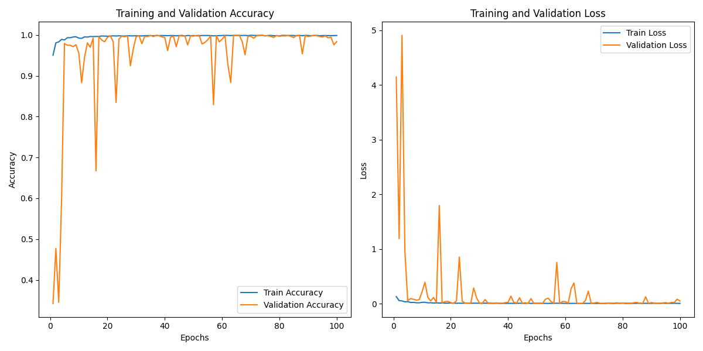

# Handwritten/Printed Text Distinguish Assessment

## Name
Omar Mohammed Ibrahim Elsayed

## Table of Contents
1. [Introduction](#introduction)
2. [Pipeline Description](#pipeline-description)
3. [Models](#models)
    - [CRAFT](#craft)
    - [MORAN](#moran)
4. [Dataset](#dataset)
5. [User Guide](#user-guide)
6. [Examples](#examples)

## Introduction
This assessment entails creating a complex pipeline capable of detecting handwritten and printed text inside photographs. The major objective is to develop an accurate and efficient system for analyzing text in diverse document pictures and classifying it as handwritten or computer-generated. This work is critical for a variety of applications, including document digitization, automatic archiving, and improved document search functionality.

The main results from this assessment are:
1. **Dataset:** A well-structured dataset containing labeled images of handwritten and printed text.
2. **Model:** A trained model capable of accurately classifying text as handwritten or printed.
3. **Pipeline:** A complete pipeline that includes data preprocessing, model inference, and result visualization.
4. **Evaluation:** Documenting the model's performance, including metrics and visualizations of training and validation accuracy and loss.

Successfully discriminating between handwritten and printed text in photographs is a vital task with several applications. The goal of this evaluation is to create an accurate and efficient classification system using sophisticated machine learning and transfer learning methods.

## Usage
To use the model, please follow these steps:
1. Clone the project from the following repository:

```bash
git clone https://github.com/Omar-Mohamed-Ibrahim-Alsayed/Text-categorization.git
```

2. Prepare your virtual environment using the requirements.txt file:

```bash
pip install -r requirements.txt
```
3. Download the model weights from [here](https://drive.google.com/drive/u/1/folders/1BzzL4RL6T8WcOK3yjDUCgBivu3sCDwtR) and add them to the weights directory in the main directory.
4. Put your images in the inputs directory.
5. Run inference.py:

```bash
python inference.py
```


## Pipeline Description
The pipeline for distinguishing between handwritten and printed text in images consists of two primary components: the CRAFT text detector and the MORAN classifier. Below is a detailed description of each component and their roles in the pipeline.

1. **Text Extraction Using CRAFT:** The Character-Region Awareness for Text detection (CRAFT) model is employed to detect and extract text regions from document images. CRAFT effectively identifies each character region and the affinity between characters, producing bounding boxes around the detected text.
2. **Bounding Box Processing:** Once CRAFT identifies the text regions, it generates bounding boxes for each detected text area. These bounding boxes are then processed and sent to the classifier for further analysis.
3. **Text Classification Using MORAN:** For text classification, the Multi-Object Rectified Attention Network (MORAN) is used. To adapt MORAN for the specific task of distinguishing between handwritten and printed text, I pruned its last layer and applied transfer learning techniques. This approach leverages MORAN's pre-existing OCR capabilities while fine-tuning it for the new classification task.
4. **Classification and Highlighting:** The modified MORAN model classifies each text region as either handwritten or printed. Based on the classification results, the original document image is updated to highlight the text regions: green for printed text and red for handwritten text.


## Models

### CRAFT
CRAFT is a robust text detector designed to effectively detect text areas by exploring each character region and the affinity between characters. It uses a binary map to identify text regions, which are then converted into bounding boxes. This model is known for its accuracy in detecting text in various languages and scripts.


### MORAN
MORAN is designed for scene text recognition, incorporating a rectification mechanism to handle distortions in text images. The model features a ResNet backbone and a bidirectional decoder for improved accuracy. For our task, we adapted MORAN by pruning its last layer to perform transfer learning from OCR to text classification.

MORAN is initially trained on a large dataset for broad scene text recognition. This pre-trained model has learned to recognize a wide range of text forms and patterns, giving it an excellent starting point for our specific purpose. The pre-trained model incorporates weights and biases acquired through thorough training on multiple text recognition datasets, including IIIT5K, SVT, and IC datasets.

To adapt MORAN for the task of classifying text as either handwritten or printed, several modifications are made:
1. **Pruning the Final Layer:** The final layer, originally designed for text recognition, is pruned or removed.
2. **New Classification Layer:** A new classification layer is added, consisting of a fully connected layer with two output units (one for each class) and a softmax activation function to produce probabilities.
<p align="center">

</p>
<p align = "center">
</p>

## Dataset
For this assessment, a custom dataset was created using the following sources:
1. **Handwritten Labeled Images:** Utilized the IAM Handwriting OCR dataset, a widely recognized dataset for handwriting recognition tasks. This dataset provided a diverse collection of handwritten text images, ensuring a robust representation of various handwriting styles. Additional scientific Arabic handwritten books were also included.
2. **Printed Text Images:** Compiled a collection of printed text from multiple sources, including books, novels, academic papers, and comic books. Additionally, generated random sentences from various books, such as the American Lawbook, using different downloaded fonts.

Creating this custom dataset allowed for a well-balanced and representative collection of both handwritten and printed text images, essential for training a reliable and accurate classification model.


